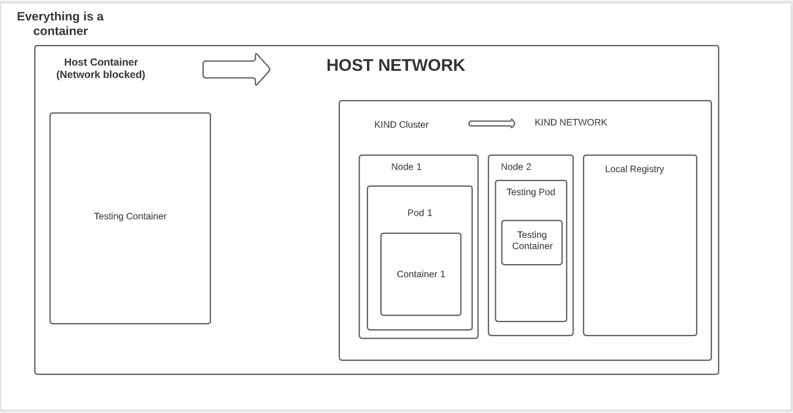

# Setup for air-gapped testing inside a docker container using KIND & DIND.

- By default, A kind cluster & a local registry is already configured inside the host container.
- local-registry will be configured at localhost:5000, so images can be pulled from the same.
- While testing, we can pull & save all required images in assets directory & mount the same inside the host container. The images which will be mounted in registry directory, will be automatically pushed to local registry inside the container (Configured on the entrypoint of container).

  > For e.g., if litmuschaos/litmusportal-frontend:ci is pulled & saved into registry directory & it has been mounted in the registry directory inside the host container. Then it will be automatically pushed to local registry. Inside the host container, the images can be pulled as localhost:5000/litmusportal-frontend:ci from local-registry.

**The directory structure & Dockerfile have been made considering dind (Docker-in-Docker) image. - https://github.com/docker-library/docker**

**Command for starting the container with no network -**

```
docker run -t --rm --network none -v "$(pwd)"/registry:/air-gapped-kind/registry --privileged jonsy13/air-gapped-kind:latest /bin/bash
```

As we have given the network as none, so there will be no access to outside internet.

Some points about the setup-

Sample pipeline with Cypress tests & ChaosCenter running inside the host container can be found here - https://github.com/Jonsy13/e2e-test/actions/runs/1616378952

In above pipeline, the tests are running inside a docker container.
The tests can also be run as a pod inside the kind cluster as well.
The logic for running tests inside the host container can be decided by user.

**Architecture**


